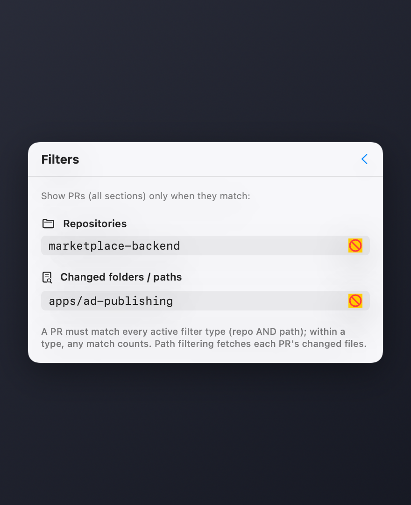

# PRism 🔺

A tiny macOS menu bar app that lists the open GitHub pull requests you **created** or **committed to** — split into a clear spectrum, always one click away.

Built with SwiftUI's `MenuBarExtra`. No tokens to manage: it reuses your existing [`gh` CLI](https://cli.github.com/) authentication.

<p align="center">
  
</p>

## The problem

Your open PRs are scattered. Some you opened; others you pushed commits to but
someone else owns. GitHub's "Pull requests" page mixes in everything you're
merely mentioned or assigned on, and you have to leave your work, open a browser,
and scan a noisy list just to answer *"what's still open on me?"*

It's easy to lose track — a PR sits unreviewed for days, or a branch you
contributed to is ready to merge and nobody pinged you.

**PRism keeps that answer in your menu bar.** A glanceable count badge tells you
how many PRs need your attention; one click shows them grouped by how you're
involved — *Created by me* vs *Committed to* — with the noise (comments,
mentions, assignments-only) filtered out. Click any row to jump straight to it.

## Features

- 🔺 Lives in the menu bar with a live count badge
- 👀 **Needs my review** — open PRs where your review is requested
- 📝 **Created by me** — open PRs you authored
- 🔨 **Committed to** — open PRs where your commits appear (even if you didn't open them)
- 🟢 **CI status** at a glance — green / red / pending dot per PR
- 🏷️ **Review state** — `APPROVED` / `CHANGES` badges, plus a merge-conflict warning
- 🔵 **Unread dots** — highlights PRs with new activity since you last looked
- 🗂️ **Open all** in the browser with one click
- 📋 **Copy link or branch** — hover any PR to copy its URL or branch name to the clipboard
- 🔍 **Filters** — scope every section by repository and by changed folder/path
- 🔄 Auto-refreshes every 3 minutes, plus a manual refresh button
- 🖱️ Click any PR to open it in your browser
- 🚫 No Dock icon, no clutter — pure menu bar agent

## How it works

PRism shells out to the `gh` CLI and runs three lightweight GraphQL calls
(GitHub's cost analyzer rejects the equivalent single mega-query), then
classifies each PR locally:

- review requested from you → *Needs my review*
- **author == you** → *Created by me*
- **your login among the commit authors** → *Committed to*
- involved only via comment / mention / assignment → ignored

Each displayed PR is then enriched with its CI rollup, review decision, and
mergeability in one batched call.

Because it uses `gh`, there are no API tokens stored in the app — it relies on
whatever account you've authenticated with `gh auth login`.

## Filtering

If your lists get noisy, open the filter panel (the slider icon in the header)
and scope **all sections** down:

<p align="center">
  
</p>

- **Repositories** — only show PRs from matching repos (substring match,
  e.g. `marketplace-backend`).
- **Changed folders / paths** — only show PRs that touch a matching path
  (e.g. `apps/ad-publishing`).

A PR must satisfy every active filter *type* (repo **and** path); within a type,
matching any entry is enough. Path filtering fetches each PR's changed files, so
it's only requested when a path filter is set. Filters persist across launches.

## Requirements

- macOS 13 (Ventura) or later
- [GitHub CLI](https://cli.github.com/) installed and authenticated:
  ```sh
  brew install gh
  gh auth login
  ```

## Build & run

Run from source during development:

```sh
swift run PRism
```

## Build the app bundle

```sh
./bundle.sh
```

This produces `dist/PRism.app` (release build, ad-hoc signed, no Dock icon).

Install it:

```sh
cp -R dist/PRism.app /Applications/
```

**Launch at login:** System Settings → General → Login Items → **+** → select `PRism.app`.

> The app is ad-hoc signed (no Apple Developer certificate). On first launch from
> `/Applications`, macOS Gatekeeper may require a right-click → **Open**.

## Configuration

Change the refresh interval in [`Sources/PRism/PRStore.swift`](Sources/PRism/PRStore.swift):

```swift
private let refreshInterval: TimeInterval = 180  // seconds
```

## Project layout

```
Package.swift              Swift package manifest (macOS 13+, executable target)
Info.plist                 App bundle metadata (LSUIElement = menu bar agent)
bundle.sh                  Builds and signs dist/PRism.app
Sources/PRism/
├── PRismApp.swift         @main entry, MenuBarExtra + badge
├── MenuContent.swift      Dropdown UI — sections, rows, refresh, quit
├── PRStore.swift          Observable state + 3-min poll timer
├── GitHubService.swift    gh CLI shell-out, GraphQL query, classification
└── PullRequest.swift      PR model
```

## License

MIT
