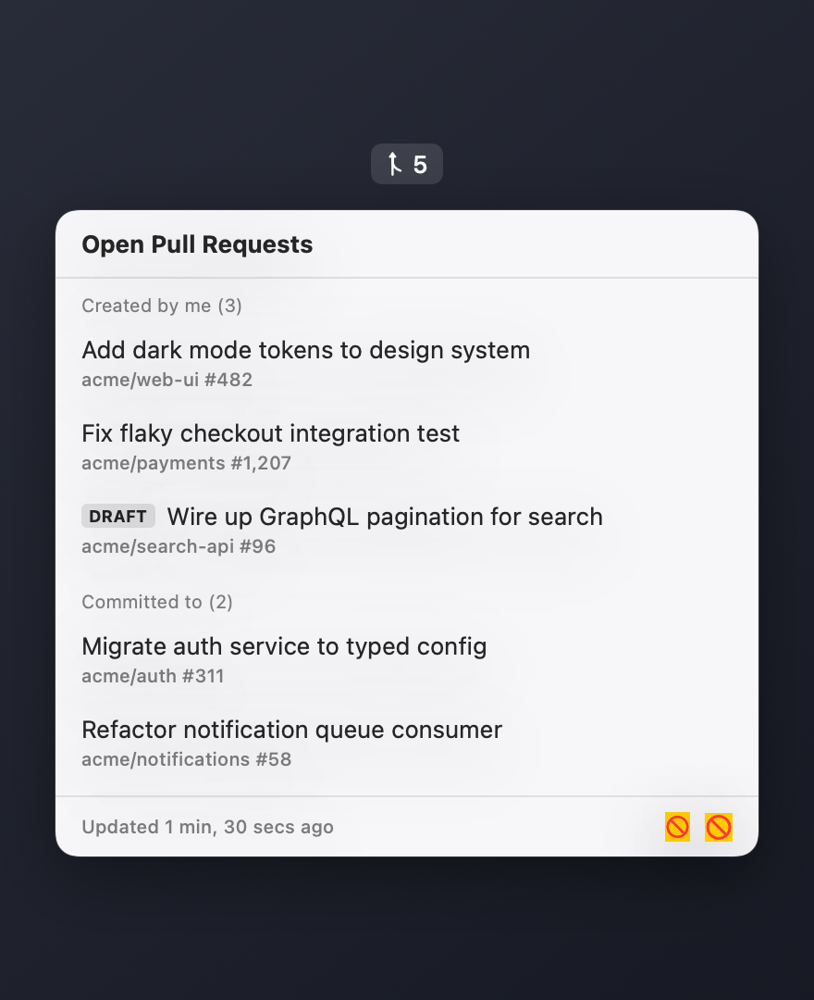

# PRism 🔺

A tiny macOS menu bar app that lists the open GitHub pull requests you **created** or **committed to** — split into a clear spectrum, always one click away.

Built with SwiftUI's `MenuBarExtra`. No tokens to manage: it reuses your existing [`gh` CLI](https://cli.github.com/) authentication.

<!-- Add a screenshot here once you have one:  -->

## Features

- 🔺 Lives in the menu bar with a live count badge
- 📝 **Created by me** — open PRs you authored
- 🔨 **Committed to** — open PRs where your commits appear (even if you didn't open them)
- 🔄 Auto-refreshes every 3 minutes, plus a manual refresh button
- 🖱️ Click any PR to open it in your browser
- 🚫 No Dock icon, no clutter — pure menu bar agent

## How it works

PRism shells out to the `gh` CLI and runs a single GraphQL search for PRs that
involve you, then classifies each one locally:

- **author == you** → *Created by me*
- **your login among the commit authors** → *Committed to*
- involved only via comment / mention / assignment → ignored

Because it uses `gh`, there are no API tokens stored in the app — it relies on
whatever account you've authenticated with `gh auth login`.

## Requirements

- macOS 13 (Ventura) or later
- [GitHub CLI](https://cli.github.com/) installed and authenticated:
  ```sh
  brew install gh
  gh auth login
  ```

## Build & run

Run from source during development:

```sh
swift run PRism
```

## Build the app bundle

```sh
./bundle.sh
```

This produces `dist/PRism.app` (release build, ad-hoc signed, no Dock icon).

Install it:

```sh
cp -R dist/PRism.app /Applications/
```

**Launch at login:** System Settings → General → Login Items → **+** → select `PRism.app`.

> The app is ad-hoc signed (no Apple Developer certificate). On first launch from
> `/Applications`, macOS Gatekeeper may require a right-click → **Open**.

## Configuration

Change the refresh interval in [`Sources/PRism/PRStore.swift`](Sources/PRism/PRStore.swift):

```swift
private let refreshInterval: TimeInterval = 180  // seconds
```

## Project layout

```
Package.swift              Swift package manifest (macOS 13+, executable target)
Info.plist                 App bundle metadata (LSUIElement = menu bar agent)
bundle.sh                  Builds and signs dist/PRism.app
Sources/PRism/
├── PRismApp.swift         @main entry, MenuBarExtra + badge
├── MenuContent.swift      Dropdown UI — sections, rows, refresh, quit
├── PRStore.swift          Observable state + 3-min poll timer
├── GitHubService.swift    gh CLI shell-out, GraphQL query, classification
└── PullRequest.swift      PR model
```

## License

MIT
